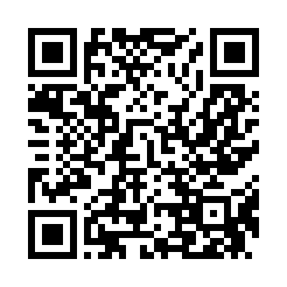

# 🌍 Projeto Social - Loreine Ewald

Projeto realizado no Curso de <strong>HTML5</strong> e <strong>CSS3</strong> do Curso em Vídeo. 
Com Professor <strong>Gustavo Guanabara</strong>.

## ✍️ Sobre o Projeto

Este é um projeto de página institucional com temática social, desenvolvido com foco em **HTML5, CSS3 e responsividade**. A ideia foi criar uma apresentação simples e elegante para uma organização fictícia, com destaque para sua missão, valores e ações.

---

## 🧠 Objetivo

O propósito deste projeto é praticar a estruturação de páginas web semânticas, com uso adequado de seções, textos institucionais, chamadas visuais e design harmonioso. É ideal para representar ONGs, projetos comunitários, ou causas sociais.

---

## 📱 Responsividade

A página se ajusta a diferentes tamanhos de tela, sendo compatível com:

- 💻 Desktops
- 📱 Smartphones
- 📟 Tablets

---

## 🔗 Acesse o Projeto

- [🔗 Clique aqui para visualizar online](https://loreineewald.github.io/projeto-social/) 
- [📂 Código-fonte no GitHub](https://github.com/loreineewald/projeto-social)

---

## 📱 Escaneie com seu celular

  

